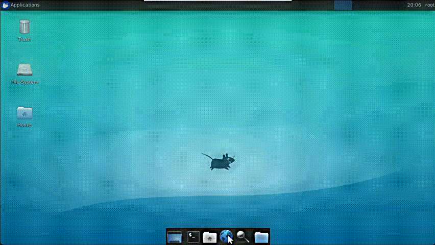

# Test Automation with Docker and SeleniumBase: Appointment Checker



A very modest but effective Docker-based automation script, leveraging [SeleniumBase](https://github.com/seleniumbase/SeleniumBase), designed to navigate through multi-page JavaScript forms and identify available appointments.

Operates seamlessly in the background, checks for appointments and also notifies users via email, complete with screenshots upon successful detection.

A full breakdown can be found at my [blogpost](https://tbalza.net/leveraging-docker-and-selenium-for-efficient-appointment-checking/).

## Requirements
Install the necessary tools using [Homebrew](https://docs.brew.sh/Installation):

```bash
brew install docker
brew install git
```

## Cloning the Repository
This project employs submodules linked to the official SeleniumBase repository, facilitating seamless updates and integration with new releases.
```bash
git clone --recurse-submodules https://github.com/tbalza/cita-checker.git
cd cita-checker
mv values-sample.json values.json
```
Edit `values.json` with your specific details to tailor the appointment checking process to your needs.

## Building the Docker Image
Construct the Docker environment tailored for running our script in the background, automating the appointment checking process:
```bash
docker build --platform linux/amd64 -t seleniumbasevnc . --progress=plain
```
Note: The `--platform` flag is optional for non-arm64 architectures and can be omitted accordingly.

## Initiating the Docker Container
Configure and deploy the container to start the appointment checking service:
```bash
docker-compose up -d
```
Upon setup, you'll receive email notifications when appointments become available.

To review application logs and monitor activity, access the container's terminal:
```bash
 docker exec -it $(docker ps -q | sed -n '1p') /bin/bash
```
View the log files:
```bash
cat /tmp/events.log
```

## Roadmap
Future enhancements aimed at improving utility and efficiency include:

- **Dockerfile Optimization:** Streamline the Dockerfile to include only essential dependencies, reducing the overall footprint and improving build times.
- **Enhanced Error Notifications:** Develop a robust notification system to alert users of consecutive errors, enhancing reliability and user experience.
- **Container Lifecycle Management:** Implement advanced container management features to automate updates, restarts, and health checks, ensuring uninterrupted service.
- **Modularity:** Currently it's only written for a deliberately obscure, particular use case. In the future maybe this could tie together with a more robust Selenium IDE integration.